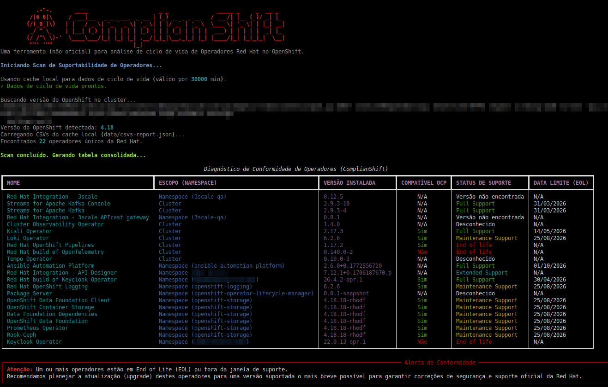

# ComplianShift CLI



**ComplianShift** is a command-line interface (CLI) tool developed in Python to perform compliance diagnostics of Operators installed on an OpenShift cluster.

The tool validates whether the versions and channels of Red Hat operators (installed via OLM - Operator Lifecycle Manager) are within the official Red Hat support window, classifying them into:
- **Full Support**
- **Maintenance Support**
- **End of Life / Unsupported**

## Key Features

1. **Cluster Discovery**: Automatically connects to your current OpenShift cluster (via `~/.kube/config`) and collects *ClusterServiceVersions* (CSVs) from the `Red Hat` provider.
2. **Red Hat API (v2) Integration**: Queries the official Red Hat Product Lifecycle API to get exact support dates for each version and checks compatibility with your current OpenShift cluster version.
3. **Upgrade Planning**: Verifies if installed operators support upcoming OpenShift versions, helping you plan cluster upgrades without breaking compatibility.
4. **Caching System**: Implements local caching (`data/product-lifecycle.json` and `data/csvs-report.json`) to avoid excessive Red Hat API calls and speed up execution, with configurable expiration time.
5. **Rich Interface and Modern CLI**: Built with `Typer` and `Rich` libraries, it displays real-time progress for each operator and consolidates results into a colorful terminal table, visually highlighting operators that require attention.

## Project Structure

The project adopts a modular architecture for easy maintenance and expansion:

```text
op-check/
├── main.py              # CLI Entry point (Typer)
├── mapping.yaml         # Dictionary: Operator Name -> Red Hat API Name (Only for check-upgrade)
├── requirements.txt     # Project dependencies
├── data/                # JSON data for operator lifecycles per OCP version and cache
├── core/
│   ├── k8s_client.py    # Kubernetes/OpenShift interaction logic
│   ├── upgrade_checker.py # Compatibility verification logic for OCP upgrades
│   └── scanner.py       # Supportability scan logic consuming API v2
└── ui/
    └── formatter.py     # Visual formatting logic (Tables and Panels via Rich)
```

## Prerequisites

- **Python 3.10** or higher.
- Access to an OpenShift cluster (user logged in via `oc login` or with properly configured `~/.kube/config`).
- Read permissions for custom resources (`customresourcedefinitions`, specifically `clusterserviceversions` and `clusterversions`).

For detailed installation and usage instructions, see the [USAGE.md](USAGE.md) file.
